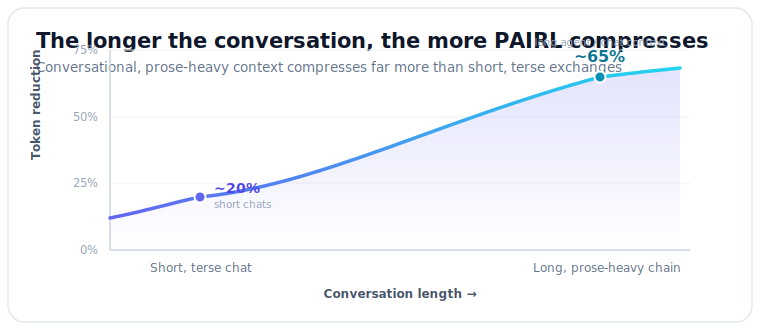

# PAIRL — Protocol for Agent Intermediate Representation (Lite)

**Version 1.6** | [Specification](SPEC.md) | [Examples](examples/) | [Contributing](CONTRIBUTING.md) | [Website](https://pairl.dev)

[](https://pypi.org/project/pairl/)
[](https://www.npmjs.com/package/pairl)
[](https://crates.io/crates/pairl)
[](LICENSE)

> **PAIRL is an officially recognized R&D project**, certified by the German Federal Ministry of Finance (BSFZ) as eligible for research and development funding under the Forschungszulagengesetz (FZulG) — effective May 2026.

---

## Overview

PAIRL is a compact, human-readable, machine-parseable message format for **agent-to-agent communication**.

Instead of verbose natural language between AI agents, PAIRL uses:

* **Two channels**: per-turn quotation or marked condensate (`#req`/`#rpt`) + lossless facts (names, numbers, evidence)
* **Extractive quotation** (v1.6): the lossy channel carries byte-exact source fragments (` [...] ` marks omissions) — an encoder LLM only chooses where to cut, a deterministic verifier re-copies every fragment from the source, so content hallucination is structurally impossible; LLM paraphrase must be explicitly marked (`mode=cond`)
* **Pointer-first state**: references instead of copying large content
* **Token efficiency**: ~47% net reduction on short exchanges, rising to ~67% on long, prose-heavy conversations (see curve below)
* **Columnar record blocks** (v1.5): repeated same-type records declare their key schema once (`#evid[claim,src,conf]` + positional rows) instead of repeating `key=` per line — ~40% fewer tokens on schema-heavy messages, lossless and back-compatible
* **Short references** (v1.4): session-local `@id m2`/`@p m1` ids and `@m1#a1` record refs separate identity from integrity, cutting threading overhead while full content-hashes stay available when needed
* **Turn attribution** (v1.3): compact `#u1`/`#a2` markers preserve *who said what* when a whole conversation is compressed into one body — assigned deterministically, so the speaker never drifts
* **Tool-use compression** (v1.2): compact encoding of tool-call/result chains (~95% reduction)
* **Economic features** (v1.1): native budget tracking, cost reporting, quota management
* **Anti-hallucination guardrails**: strict separation of facts from style
* **Transport-agnostic**: works anywhere (HTTP, files, message queues, WebSocket)



---

## Quick Example

```
@v 1
@id m1
@sid ref:sess:01JH0Q6Z7F8K4Q2S1R6E2E9A3B
@ts 2026-01-31T16:20:01.123+01:00

req{t=specs,s=f,l=2,m=+,a=c} @rid=a1
#fact ask=spec_document @rid=f1
#fact format=pdf_or_link @rid=f2
#fact deadline=2026-02-05 @rid=f3
#ref specs=ref:doc:sha256:9c1a0f2b3e4d5c6f7a8b9c0d1e2f3a4b @rid=r1
```

**What this says**:
* **Lossy intent** (`req`): "I'm making a formal request about specs, medium length, positive mood, for client audience"
* **Lossless facts**: deadline is 2026-02-05, format is pdf or link, asking for spec_document
* **Reference**: points to document by content hash instead of copying it

See [examples/](examples/) for complete threaded conversations.

---

## Why PAIRL?

### Problem: Agent Verbosity

When AI agents talk to each other using natural language:

* **Token waste**: "According to the document you provided..." instead of `ref:doc:sha256:...`
* **Hallucination risk**: facts mixed with style/prose
* **Parsing overhead**: LLMs must re-parse generated prose
* **Context limits**: verbose messages burn context windows

### Solution: Structured Intermediate Format

PAIRL gives agents a **compact wire format** while preserving natural language for humans:

```
Agent A --> [PAIRL message] --> Agent B
                                    ↓
                            [PAIRL renderer]
                                    ↓
                                 Human
```

**Natural language only appears at the final human endpoint.**

---

## Core Principles

### 1. Two Channels

* **Lossy channel**: what each turn said — `#req`/`#rpt` records carrying quoted source text (v1.6 default; ` [...] ` marks omissions) or an explicitly marked condensate (`mode=cond`). Intents like `req{t=specs,s=f,l=2}` remain as optional stance signals.
* **Lossless channel**: `#fact`, `#ref`, `#evid` (facts, pointers, evidence)

**Rule**: Anything that must be correct later (names, numbers, dates, URLs) goes in the lossless channel.

### 2. Pointer-First State

Don't copy large content. Reference it:

```
#ref doc=ref:doc:sha256:9c1a0f2b3e4d5c6f7a8b9c0d1e2f3a4b
```

### 3. Message Threading

Messages form a DAG (directed acyclic graph) using **short session-local ids** (v1.4):

```
@id m4
@sid ref:sess:01JH0Q6Z7F8K4Q2S1R6E2E9A3B   # declared once on the root
@p m3                                        # parent; @root omitted when derivable via @p
@deps m2
```

The 26-char ULID is paid once per thread (`@sid`), not on every reference — see [SPEC §2, §10](SPEC.md).

### 4. Validation & Integrity

* Anti-hallucination rule: `#rule no_new_facts=true` (intents can't contain facts)
* Content hashing: `@hash ref:hash:sha256:...` (immutable audit trail)
* Evidence tracking: `#evid claim="..." src=ref:... conf=0.85`

### 5. Economic Features (v1.1)

* **Budget enforcement**: `@budget 0.50USD` limits spending per task
* **Cost tracking**: `#cost val=0.02 cur=USD model=gpt-4o` reports actual costs
* **Quota management**: `#quota type=tokens total=100000 used=5000` tracks resource usage
* **Bidding**: agents propose resource needs before execution

### 6. Tool-Use Compression (v1.2)

* **Tool calls**: `#call tool=Read file="/src/app.ts"` records tool invocations
* **Tool results**: `#ret call=c01 status=ok lines=450 sig="..."` summarizes results
* **Reasoning**: `#think summary="identified root cause"` captures decision chain
* **Edit aggregation**: `#edit file="/src/proxy.ts" changes=3 summary="..."` collapses edits

### 7. In-Body Turn Attribution (v1.3)

When a whole multi-turn conversation is compressed into a single body, message-level threading (§3) can't say *who* spoke each line. Compact turn markers do:

```
#u1
req{t=launch} @rid=a1
#fact ramp=5pct @rid=f1
#a2
pln{t=rollout} @rid=a2
#fact window=30min @rid=f2
```

* **`#u1` / `#a2` / `#s3`** mark each turn — letter is the speaker (user/assistant/system), number is the order.
* Records belong to the **most recent marker above them** (section grouping), so the speaker is unambiguous with almost no overhead.
* Markers are assigned **deterministically by the encoder/gateway** (the speaker is structural metadata), so attribution can't drift — unlike inferring the speaker from a flattened record stream.

---

## Use Cases

* **Multi-agent systems**: agents exchanging context/results
* **LLM pipelines**: research → analysis → writing
* **Tool-use conversations**: Claude Code, Cursor, agentic workflows
* **Agent logging/debugging**: compact audit trails
* **Human-in-the-loop**: review agent reasoning before execution
* **Agentic APIs**: structured requests/responses

Commercial use is permitted under Apache 2.0 (see [LICENSE](LICENSE)).

---

## Getting Started

### 1. Read the Spec

Start with [SPEC.md](SPEC.md) for the complete v1.6 specification.

### 2. Explore Examples

See [examples/](examples/) for:
* Basic request/response
* Threaded multi-agent conversations
* Evidence-based reporting
* Complex workflows
* Tool-use sessions
* Turn attribution — a conversation compressed into one body with `#u1`/`#a2` markers ([07](examples/07-turn-attribution.pairl) · [rendered](examples/07-turn-attribution.rendered.md))

### 3. Install a Reference Library

All three reference implementations are published as **`pairl`**:

```bash
pip install pairl        # Python
npm install pairl        # TypeScript
cargo add pairl          # Rust
```

Parse, validate, and hash a message — Python:

```python
import pairl

msg = pairl.parse(open("message.pairl").read())
res = pairl.validate(msg)            # rules V1–V12
print(pairl.compute_hash(msg))       # canonical SHA-256
print(pairl.render(msg))             # human-readable rendering
```

TypeScript:

```ts
import { parse, validate, computeHash, render } from "pairl";

const msg = parse(pairlText);
const res = validate(msg);           // rules V1–V12
console.log(computeHash(msg), render(msg));
```

Each package README covers the full API and CLI:

* [Python](impl/python/) ([PyPI](https://pypi.org/project/pairl/)) — parser, validator (V1–V12), canonicalization + SHA-256, NL renderer, CLI
* [TypeScript](impl/typescript/) ([npm](https://www.npmjs.com/package/pairl)) — parse/serialize/validate/canonicalize + hash, encode/decode
* [Rust](impl/rust/) ([crates.io](https://crates.io/crates/pairl)) — std-only parser + validator (V1–V12) with CLI

All three are kept in lockstep against a shared [conformance corpus](impl/conformance/).

### 4. Integrate

PAIRL works as payload in any system — HTTP, files, message queues, WebSocket (see §15.3 in SPEC.md).

---

## Project Status

**Current version**: 1.6 (July 2026)

* Core spec stabilized (v1.0)
* Economic features added (v1.1)
* Tool-use compression added (v1.2)
* In-body turn attribution added (v1.3)
* Session-local short references added (v1.4)
* Columnar record blocks added (v1.5)
* Extractive/condensate carriage forms, per-body legend, session maintenance profile added (v1.6)
* Reference implementations **published as `pairl`** on [PyPI](https://pypi.org/project/pairl/), [npm](https://www.npmjs.com/package/pairl), and [crates.io](https://crates.io/crates/pairl) — Python, TypeScript, and Rust ([`impl/`](impl/)), released in lockstep against a shared cross-implementation [conformance corpus](impl/conformance/)
* Community feedback welcome

See [CHANGELOG.md](CHANGELOG.md) for version history.

---

## Contributing

We welcome contributions! See [CONTRIBUTING.md](CONTRIBUTING.md) for:

* How to propose spec changes
* Adding new intent types
* Reference implementation guidelines
* Reporting issues

---

## License

PAIRL specification and reference implementations are licensed under the **Apache License 2.0**.

This permissive license:
* Allows commercial use
* Includes explicit patent grant protection
* Requires attribution and license notice preservation

See [LICENSE](LICENSE) for full details.

---

## Links

* [Full Specification](SPEC.md)
* [Examples](examples/)
* [Contributing](CONTRIBUTING.md)
* [Changelog](CHANGELOG.md)
* Packages: [PyPI](https://pypi.org/project/pairl/) · [npm](https://www.npmjs.com/package/pairl) · [crates.io](https://crates.io/crates/pairl)

---

**PAIRL**: compact, reliable, interoperable agent communication.
